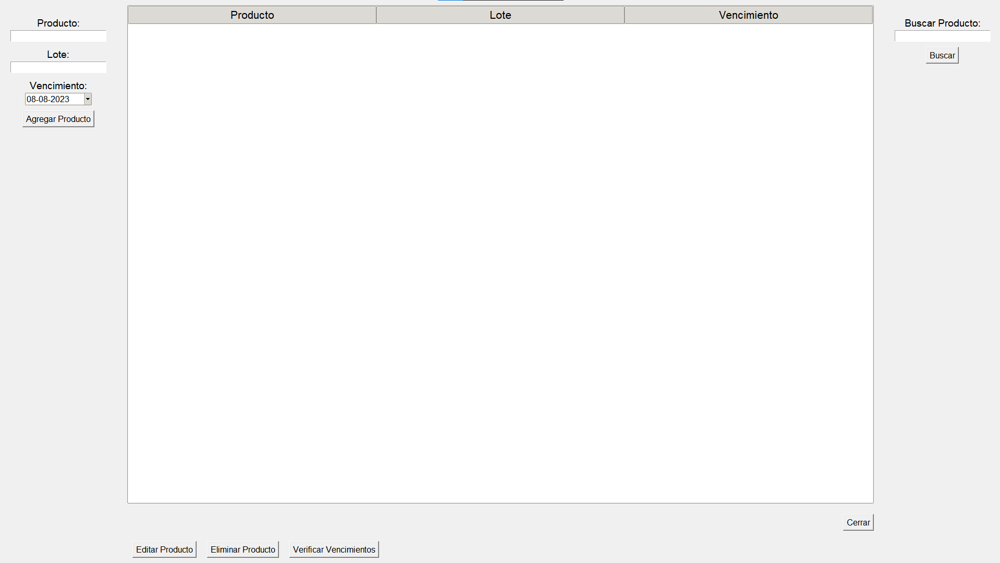
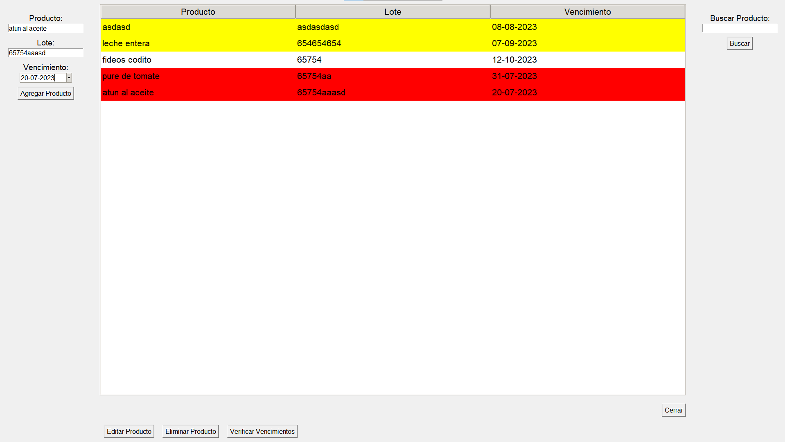

# Gestor de Productos

El "Gestor de Productos" es una aplicación de escritorio desarrollada en Python con la biblioteca tkinter. Esta aplicación permite a los usuarios gestionar y realizar un seguimiento de los productos, sus lotes y fechas de vencimiento.

## Características

- Agregar productos con información detallada, como nombre, lote y fecha de vencimiento.
- Buscar productos por nombre o número de lote.
- Verificar y resaltar productos próximos a vencer o vencidos.
- Editar y eliminar productos existentes.
- Interfaz de usuario amigable y fácil de usar.

## Requisitos

- Python 3.x instalado.
- Librerías utilizadas: tkinter, ttkthemes, tkcalendar.

## Instrucciones de Uso

1. Ejecuta el archivo "gestor_productos.py" usando Python.
2. Agrega productos utilizando los campos correspondientes.
3. Utiliza el botón "Buscar" para buscar productos por nombre o lote.
4. Utiliza el botón "Editar Producto" para modificar información existente.
5. Utiliza el botón "Eliminar Producto" para eliminar productos de la lista.
6. Utiliza el botón "Verificar Vencimientos" para resaltar productos próximos a vencer o vencidos.

## Capturas de Pantalla

## Notas

- Esta aplicación utiliza una base de datos SQLite para almacenar los productos y sus detalles.
- Se incluye un archivo ejecutable para Windows en la carpeta "dist".

## Licencia

Este proyecto se distribuye bajo la licencia [MIT](LICENSE).
